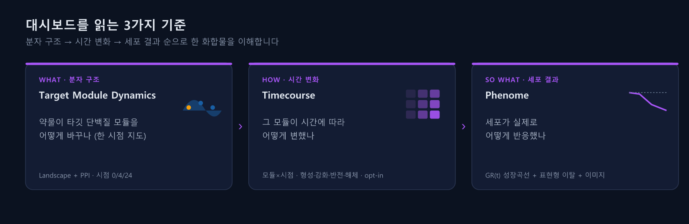
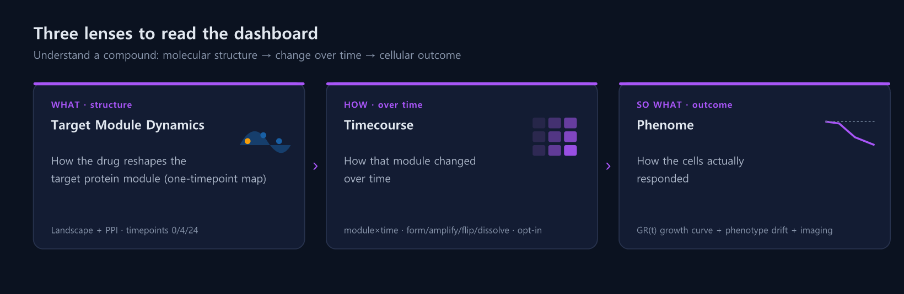
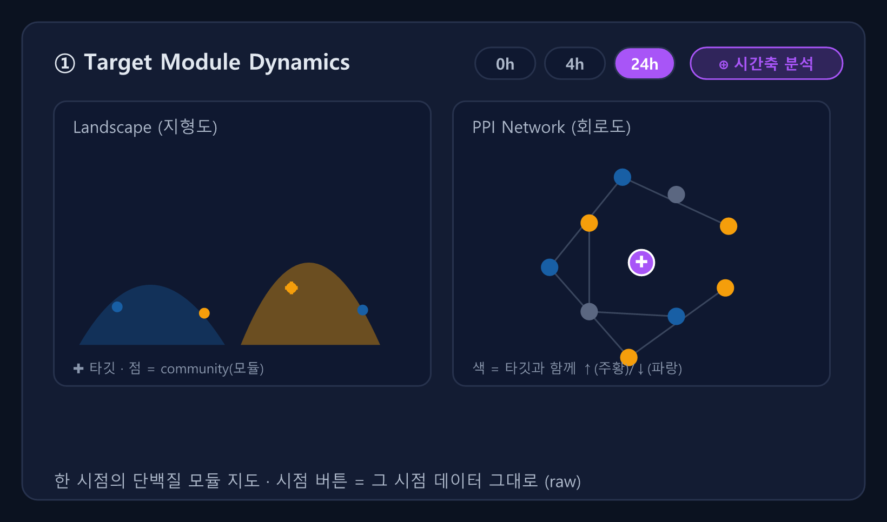
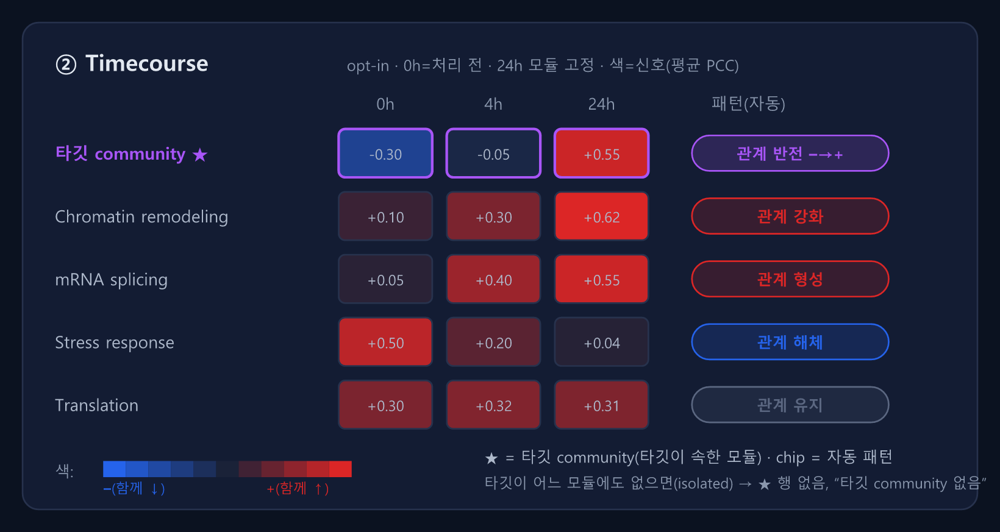
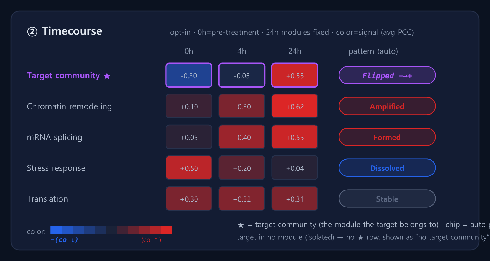
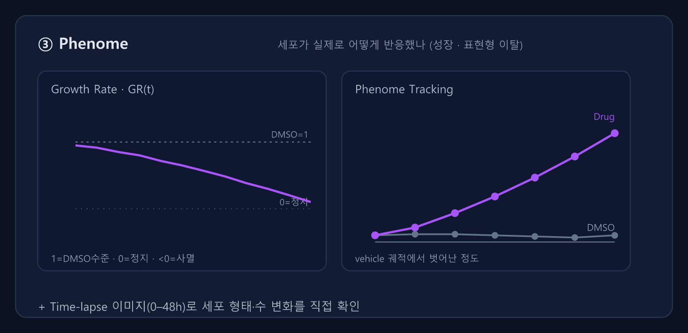
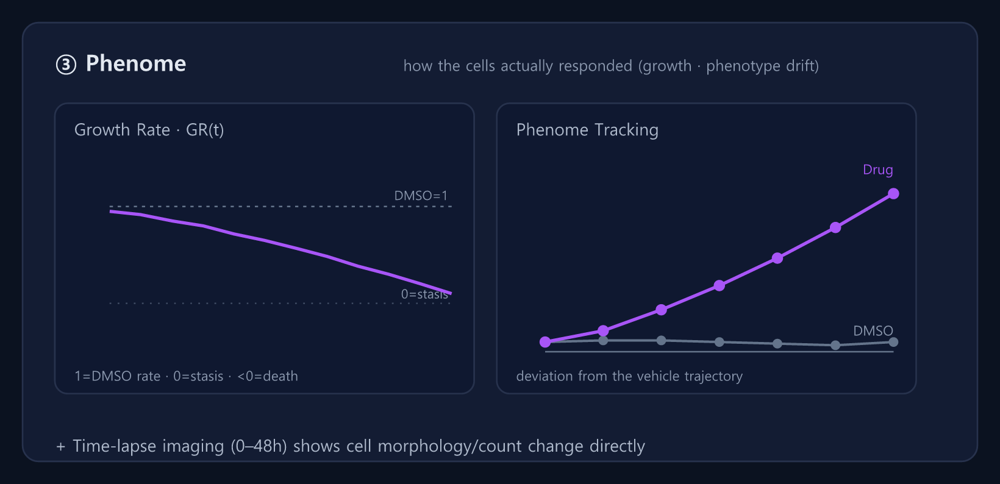

# guide_dashboard — 대시보드 3 기준 설명 (제작팀 제작용)

> **목적**: GuidePage의 **dashboard 섹션 하위**에 들어갈 *Dynamics / Timecourse / Phenome* 설명.
> **원칙**: 텍스트는 최소, **시각자료가 설명을 끌고 간다**. 모든 문구는 **이중언어(KO | EN)** — 그대로 `t("ko","en")`에 넣으면 됨.
> **이미지**: `docs/mock/guide-dashboard-*.png`(한국어) · `*-en.png`(영어). 제작 시 `frontend/public/guide/`로 복사해 `src` 참조.
> **섹션 매핑**: 대시보드 `SECTION_NAV` id와 1:1 — `dynamics` / `timecourse` / `phenome` (DashboardPage.tsx).

---

## 0. 한눈에 (Overview)

| KO | EN |
|---|---|
|  |  |

**한 줄 / one-liner** — `t( … )`:
- KO: "대시보드는 **3가지 기준**으로 읽습니다 — 분자 구조(Dynamics) → 시간 변화(Timecourse) → 세포 결과(Phenome)."
- EN: "Read the dashboard through **three lenses** — molecular structure (Dynamics) → change over time (Timecourse) → cellular outcome (Phenome)."

> 내러티브: **WHAT**(무엇이) → **HOW/WHEN**(어떻게·언제 변하나) → **SO WHAT**(그래서 세포는).

---

## 1. Target Module Dynamics — `#dynamics`

| KO | EN |
|---|---|
|  |  |

**이건 뭐 / What it is** — `t( … )`:
- KO: "약물이 **타깃 단백질 모듈**을 어떻게 바꾸는지 보는 **한 시점의 지도**입니다. 왼쪽 Landscape(지형도) + 오른쪽 PPI(회로도)가 한 몸."
- EN: "A **one-timepoint map** of how the drug reshapes the **target's protein module** — Landscape (left) and PPI network (right) as one unit."

**어떻게 읽나 / How to read** (bullets, KO | EN):
| KO | EN |
|---|---|
| **✚ = 타깃**, 점·노드 = 함께 묶이는 단백질(community/모듈) | **✚ = target**; dots/nodes = proteins grouped together (community/module) |
| 노드 **색** = 타깃과 함께 **↑증가(주황)/↓감소(파랑)** | Node **color** = moves with target **↑up (orange) / ↓down (blue)** |
| 상단 **`0h/4h/24h` 버튼** = 그 시점 데이터 그대로(raw). **⊕ 시간축 분석**으로 시간 비교 열기 | Top **`0h/4h/24h`** = that timepoint's raw data. **⊕ Timecourse** opens the time comparison |

---

## 2. Timecourse — `#timecourse` (opt-in)

| KO | EN |
|---|---|
|  |  |

**이건 뭐 / What it is** — `t( … )`:
- KO: "각 **모듈이 시간(0h→24h)에 따라 어떻게 변했나**를 한 표로. **0h=약물 처리 전**, 24h 모듈을 기준 칸으로 고정해 비교합니다. *(원하는 사람만 — opt-in)*"
- EN: "One table of **how each module changed over time (0h→24h)**. **0h = pre-treatment**; 24h modules are the fixed reference bins. *(opt-in — only if you want it)*"

**어떻게 읽나 / How to read** (KO | EN):
| KO | EN |
|---|---|
| 행 = **모듈(community)**, top GO 이름 · 열 = 0h/4h/24h · **칸 색 = 신호 세기**(파랑 −, 빨강 +) | Row = **module (community)**, top GO label · col = 0h/4h/24h · **cell color = signal** (blue −, red +) |
| 오른쪽 **패턴 칩**이 자동으로 판정 (아래 5종) | The **pattern chip** on the right is an automatic verdict (5 types below) |
| **★ = 타깃 community**(타깃이 속한 모듈) · 지표 *참여율 / 평균 PCC* 토글 | **★ = target community** (the module the target belongs to) · metric *participation / avg PCC* |
| ⚠ **타깃이 어느 모듈에도 없으면(isolated)** → ★ 행 없음, "타깃 community 없음" 표시 → [커뮤니티 예외 안내] 참고 | ⚠ **If the target is in no module (isolated)** → no ★ row, shown as "no target community" → see the [community exception note] |

> 주의: ★ 행은 **타깃 유전자 한 줄이 아니라 타깃이 속한 community(모듈) 전체**의 시간 변화다. 타깃이
> 커뮤니티에 안 묶이는 경우(isolated/absent)는 GuidePage의 "타깃이 community에 안 묶였다면?" 예외 안내와 연결.

**패턴 5종 / Five patterns** (칩 라벨 그대로 — Dashboard 코드와 일치):
| 칩 / Chip | KO | EN |
|---|---|---|
| 🟣 관계 반전 −→+ / Flipped | baseline 음(−) → 24h 양(+). 강한 약물 신호 | negative at baseline → positive by 24h; strong signal |
| 🔴 관계 강화 / Amplified | 원래 있던 동변동을 약물이 강화 | drug strengthened an existing co-variation |
| 🔴 관계 형성 / Formed | baseline 약함 → 24h 새 관계 형성 | weak at baseline → new relationship by 24h |
| 🔵 관계 해체 / Dissolved | baseline 강한 모듈이 24h에 약화 | strong baseline module weakened by 24h |
| ⚪ 관계 유지 / Stable | 거의 안 변함 — 약물 효과 미약 | barely changes — weak drug effect |

---

## 3. Phenome — `#phenome`

| KO | EN |
|---|---|
|  |  |

**이건 뭐 / What it is** — `t( … )`:
- KO: "분자 변화의 **결과 — 세포가 실제로 어떻게 반응했나**. 성장 속도(GR)와 표현형 이탈, 그리고 실제 이미지로 확인."
- EN: "The **outcome of the molecular changes — how the cells actually responded**: growth rate (GR), phenotype drift, and the real images."

**어떻게 읽나 / How to read** (KO | EN):
| KO | EN |
|---|---|
| **GR(t)**: 1=DMSO 수준 · 0=정지 · **<0=사멸** (보라=약물, 점선=DMSO) | **GR(t)**: 1=DMSO rate · 0=stasis · **<0=death** (purple=drug, dashed=DMSO) |
| **Phenome Tracking**: vehicle(대조) 궤적에서 **벗어난 정도** = 표현형 이탈 | **Phenome Tracking**: **deviation** from the vehicle trajectory = phenotype drift |
| **Time-lapse 이미지**(0–48h)로 세포 형태·수 변화를 직접 확인 | **Time-lapse imaging** (0–48h) shows morphology/count change directly |

---

## 4. 제작 메모 (개발팀)

- **위치**: `GuidePage.tsx`의 `section === "dashboard"` 하위. 기존 커뮤니티 설명 블록과 같은 패턴(이미지 + 짧은 번호/불릿).
- **문구**: 위 표의 KO | EN 쌍을 그대로 `t("…","…")`에 사용. **불릿은 3개 이내** 유지(텍스트 과잉 금지가 이 문서의 목적).
- **이미지**: `docs/mock/guide-dashboard-*.png`(한) / `*-en.png`(영)을 `public/guide/`로 복사 후, 현재 언어(`uiLang`)에 따라 `*-en` 스왑.
  - 권장 패턴: `const sfx = lang === "en" ? "-en" : ""; src={\`/guide/guide-dashboard-${key}${sfx}.png\`}`
- **반응형**: 각 이미지는 가로 기준 디자인 → `className="w-full block"`, 배경 `#0b1220`(가이드 figure 톤과 일치).
- **정합**: Dynamics의 시점 토글/⊕버튼, Timecourse 패턴 5종·지표 토글은 **실제 구현(DashboardPage / TimecourseDrawer)과 1:1**. 라벨 바뀌면 이미지·문구 동시 갱신.
- **출처**: 이 설명의 근거·상세는 `time-comparison-4h-24h-design.md`(§3.5 히트맵, §9 v1=raw 송출) 참고.

---

## 부록 — 이미지 파일 목록

| 용도 | 한국어 | 영어 |
|---|---|---|
| 한눈에 | `guide-dashboard-overview.png` | `guide-dashboard-overview-en.png` |
| Dynamics | `guide-dashboard-dynamics.png` | `guide-dashboard-dynamics-en.png` |
| Timecourse | `guide-dashboard-timecourse.png` | `guide-dashboard-timecourse-en.png` |
| Phenome | `guide-dashboard-phenome.png` | `guide-dashboard-phenome-en.png` |
